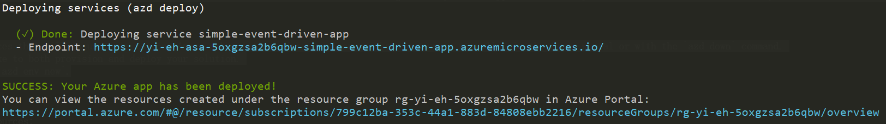
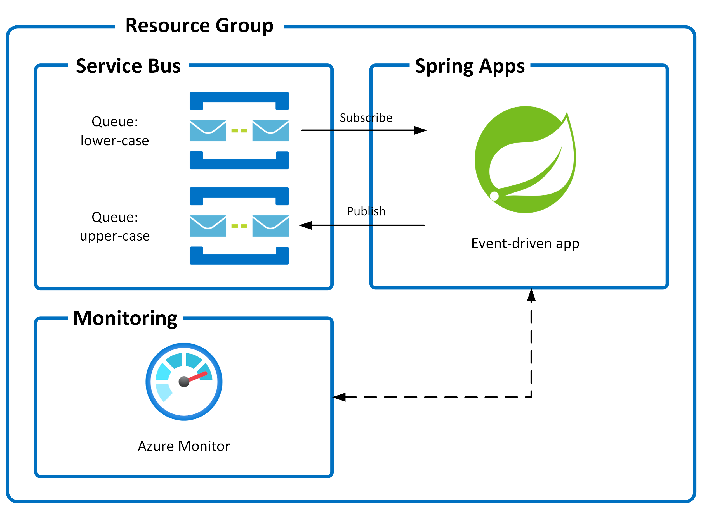

<!-- YAML front-matter schema: https://review.learn.microsoft.com/en-us/help/contribute/samples/process/onboarding?branch=main#supported-metadata-fields-for-readmemd -->

# Event Driven Application with Azure Service Bus on Azure Spring Apps

A complete event-driven application that includes everything you need to build, deploy, and monitor an Azure solution. This application uses the Azure Developer CLI (azd) to get you up and running on Azure quickly, Java for the application, Azure Service Bus for the message queue, Azure Key Vault for storing application secrets and Azure Monitor for monitoring and logging. It includes application code, tools, and pipelines that serve as a foundation from which you can build upon and customize when creating your own solutions.

Let's jump in and get the event-driven app up and running in Azure. When you are finished, you will have a fully functional event driven app deployed on Azure. In later steps, you'll see how to setup a pipeline and monitor the application.

### Prerequisites

The following prerequisites are required to use this application. Please ensure that you have them all installed locally.

- [Azure Developer CLI](https://aka.ms/azd-install)
- [Java 17 or later](https://learn.microsoft.com/en-us/java/openjdk/install)

### Quickstart

The fastest way for you to get this application up and running on Azure is to use the `azd up` command. This single command will create and configure all necessary Azure resources - including access policies and roles for your account and service-to-service communication with Managed Identities.

1. Open a terminal, create a new empty folder, and change into it.
2. Run the following command to initialize the project.

```bash
azd init --template https://github.com/Azure-Samples/ASA-Samples-Event-Driven-Application/
```

This command will clone the code to your current folder and prompt you for the following information:

- `Environment Name`: This will be used as a prefix for the resource group that will be created to hold all Azure resources. This name should be unique within your Azure subscription.

3. Run the following command to package a deployable copy of your application, provision the template's infrastructure to Azure and also deploy the application code to those newly provisioned resources.

```bash
azd up
```

This command will prompt you for the following information:

- `Azure Location`: The Azure location where your resources will be deployed.

> NOTE: This template may only be used with the following Azure locations:
>
> - Australia East
> - Brazil South
> - Canada Central
> - Central US
> - East Asia
> - East US
> - East US 2
> - Germany West Central
> - Japan East
> - Korea Central
> - North Central US
> - North Europe
> - South Central US
> - UK South
> - West Europe
> - West US
>
> If you attempt to use the template with an unsupported region, the provision step will fail.

- `Azure Subscription`: The Azure Subscription where your resources will be deployed.

> NOTE: This may take a while to complete as it executes three commands: `azd package` (packages a deployable copy of your application), `azd provision` (provisions Azure resources), and `azd deploy` (deploys application code). You will see a progress indicator as it packages, provisions and deploys your application.

When `azd up` is complete it will output the following URLs:

- Azure Portal link to view resources
- Event Driven application



Click the Azure Portal URL and find your Service Bus. Use the [Service Bus Explorer](https://learn.microsoft.com/azure/service-bus-messaging/explorer#send-a-message-to-a-queue-or-topic) to send messages to the `lower-case` queue, and navigate to the `upper-case` queue to check that there's a new message. This will create monitoring activity in the application that you will be able to see later when you run `azd monitor`.

> NOTE:
>
> - The `azd up` command will create Azure resources that will incur costs to your Azure subscription. You can clean up those resources manually via the Azure portal or with the `azd down` command.
> - You can call `azd up` as many times as you like to both provision and deploy your solution.
> - You can always create a new environment with `azd env new`.

### Application Architecture

This application utilizes the following Azure resources:

- [**Azure Spring Apps**](https://docs.microsoft.com/azure/spring-apps/) to host the application
- [**Azure Service Bus**](https://docs.microsoft.com/azure/service-bus/) for message queue
- [**Azure Monitor**](https://docs.microsoft.com/azure/azure-monitor/) for monitoring and logging
- [**Azure Key Vault**](https://docs.microsoft.com/azure/key-vault/) for securing secrets

Here's a high level architecture diagram that illustrates these components. Notice that these are all contained within a single [resource group](https://docs.microsoft.com/azure/azure-resource-manager/management/manage-resource-groups-portal), that will be created for you when you create the resources.



> This template provisions resources to an Azure subscription that you will select upon provisioning them. Please refer to the [Pricing calculator for Microsoft Azure](https://azure.microsoft.com/pricing/calculator/) and, if needed, update the included Azure resource definitions found in `infra/main.bicep` to suit your needs.

### Application Code

The repo is structured to follow the [Azure Developer CLI](https://aka.ms/azure-dev/overview) conventions including:

- **Source Code**: All application source code is located in the `src` folder.
- **Infrastructure as Code**: All application "infrastructure as code" files are located in the `infra` folder.
- **Azure Developer Configuration**: An `azure.yaml` file located in the root that ties the application source code to the Azure services defined in your "infrastructure as code" files.
- **GitHub Actions**: A sample GitHub action file is located in the `.github/workflows` folder.
- **VS Code Configuration**: All VS Code configuration to run and debug the application is located in the `.vscode` folder.

### Azure Subscription

This template will create infrastructure and deploy code to Azure. If you don't have an Azure Subscription, you can sign up for a [free account here](https://azure.microsoft.com/free/). Make sure you have contributor role to the Azure subscription.

### Next Steps

At this point, you have a complete application deployed on Azure. But there is much more that the Azure Developer CLI can do. These next steps will introduce you to additional commands that will make creating applications on Azure much easier. Using the Azure Developer CLI, you can setup your pipelines and monitor your application.

#### Set up a pipeline using `azd pipeline`

This template includes a GitHub Actions pipeline configuration file that will deploy your application whenever code is pushed to the main branch. You can find that pipeline file here: `.github/workflows`.

Setting up this pipeline requires you to give GitHub permission to deploy to Azure on your behalf, which is done via a Service Principal stored in a GitHub secret named `AZURE_CREDENTIALS`. The `azd pipeline config` command will automatically create a service principal for you. The command also helps to create a private GitHub repository and pushes code to the newly created repo.

Run the following command to set up a GitHub Action:

```bash
azd pipeline config
```

> Support for Azure DevOps Pipelines is coming soon to `azd pipeline config`. In the meantime, you can follow the instructions found here: [.azdo/pipelines/README.md](./.azdo/pipelines/README.md) to set it up manually.

#### Monitor the application using `azd monitor`

To help with monitoring applications, the Azure Dev CLI provides a `monitor` command to help you get to the various Application Insights dashboards.

- Run the following command to open the "Overview" dashboard:

  ```bash
  azd monitor --overview
  ```

- Live Metrics Dashboard

  Run the following command to open the "Live Metrics" dashboard:

  ```bash
  azd monitor --live
  ```

- Logs Dashboard

  Run the following command to open the "Logs" dashboard:

  ```bash
  azd monitor --logs
  ```

#### Clean up resources

When you are done, you can delete all the Azure resources created with this template by running the following command:

```bash
azd down
```

### Additional azd commands

The Azure Developer CLI includes many other commands to help with your Azure development experience. You can view these commands at the terminal by running `azd help`. You can also view the full list of commands on our [Azure Developer CLI command](https://aka.ms/azure-dev/ref) page.

## Troubleshooting/Known issues

Sometimes, things go awry. If you happen to run into issues, then please review our ["Known Issues"](https://aka.ms/azure-dev/knownissues) page for help. If you continue to have issues, then please file an issue in our main [Azure Dev](https://aka.ms/azure-dev/issues) repository.

## Security

### Roles

This template creates a [managed identity](https://docs.microsoft.com/azure/active-directory/managed-identities-azure-resources/overview) for your app inside your Azure Active Directory tenant, and it is used to authenticate your app with Azure and other services that support Azure AD authentication like Key Vault via access policies. You will see principalId referenced in the infrastructure as code files, that refers to the id of the currently logged in Azure Developer CLI user, which will be granted access policies and permissions to run the application locally. To view your managed identity in the Azure Portal, follow these [steps](https://docs.microsoft.com/azure/active-directory/managed-identities-azure-resources/how-to-view-managed-identity-service-principal-portal).

### Key Vault

This template uses [Azure Key Vault](https://docs.microsoft.com/azure/key-vault/general/overview) to securely store your Service Bus connection string for the provisioned Service Bus namespace. Key Vault is a cloud service for securely storing and accessing secrets (API keys, passwords, certificates, cryptographic keys) and makes it simple to give other Azure services access to them. As you continue developing your solution, you may add as many secrets to your Key Vault as you require.

## Uninstall

To remove the Azure Developer CLI, refer to [uninstall Azure Developer CLI](https://aka.ms/azd-install?tabs=baremetal%2Cwindows#uninstall-azd).

## Reporting Issues and Feedback

If you have any feature requests, issues, or areas for improvement, please [file an issue](https://aka.ms/azure-dev/issues). To keep up-to-date, ask questions, or share suggestions, join our [GitHub Discussions](https://aka.ms/azure-dev/discussions). You may also contact us via AzDevTeam@microsoft.com.